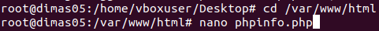

LAPORAN RESMI

KONSEP JARINGAN

|

Dr. Ferry Astika Saputra ST, M.Sc.
|
| :- |

Nama	: Awan Abdillah Akbar D

Kelas	: D4 Teknik Informatika - A

NRP	: 3121600016

**Instal Web Serever dan FTP pada Ubuntu**

1. **Web Server**

Sebelum memulai, pastikan apache sudah terinstal terlebih dahulu. Untuk menginstal apache seperti gambar di bawah lalu tunggu hingga selesai.

Jika sudah selesai, cek ip yang didapat dari virtual box dengan mengetik “ifconfig”. Terlihat pada ip yang didapat  adalah 192.168.1.11

Jika sudah mendapatkan ip cek pada browser lalu ketik ip tersebut. Jika berhasil maka akan muncul tampilan web Apache2

Lalu kembali pada terminal dan instal php, tunggu hingga proses selesai

Jika sudah selesai, masuk ke folder html dengan mengetik “cd /var/www/html” lalu ketik nano phpinfo.php untuk membuat file phpinfo

Setelah masuk ke file tersebut ketikan kode seperti gambar di bawah di dalam file tersebut

Jika sudah selesai, restart apache dengan mengetik seperti di bawah

Lalu cek apakah php sudah terpasang pada web service dengan membuka browser lalu ketik ip yang di dapat tadi lalu tambahkan “/phpinfo.php”

Jika sudah berhasil, instal phpmyadmin dan tunggu hingga selesai

Jika sudah selesai menginstal ketik command seperti berikut, jika berhasil maka mysql sudah terinstal pada ubuntu

Lalu cek pada browser dengan mengetik ip lalu tambahkan “/phpmyadmin”

Jika sudah berhasil, kembali ke terminal lalu buat folder yang berisi web yang akan ditampilkan dan buat file index.html

Lalu buat website sederhana menggunakan html untuk ditampilkan di browser lokal

Setelah selesai membuat, restart apache dan pergi ke browser untuk mengecek website yang sudah dibuat

Pergi ke browser lalu tambahkan folder website yang dibuat sebelumnya

Pada tampilan website yang saya buat menggunakan logika setelah 4 detik langsung diarahkan ke halaman landing page produk saya

1. **FTP Server**

Sebelum memulai instal ftp terlebih dahulu dan tunggu hingga selesai

Setelah berhasil instal, buat user baru untuk dipasang ftp

Setelah berhasil membuat akun, buat folder data di dalam user yang dibuat sebelumnya. Lalu ikuti command seperti di bawah dan menambahkan password pada ftp tersebut dan mengubah akses baca dengan chmod. Setelah itu buka file proftpd.conf

Setelah itu ubah server name yang diinginkan

Lalu pergi ke bagian paling bawah dan tambahkan kode seperti berikut

Setelah selesai konfigurasi ftp, restart ftp server dan lihat status tersebut, jika terdapat active running maka ftp server berhasil dijalankan.

Setelah itu buka brwoser dan ketik server name yang di masukkan sebelumnya

